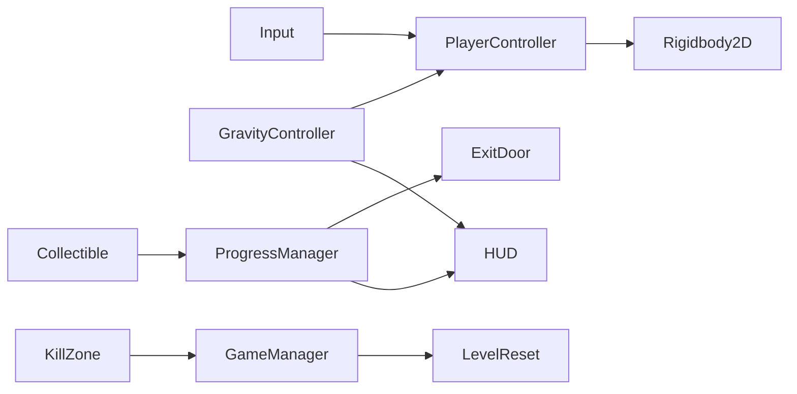

# Gravity Flip — Game Concept and Design

> Module: Game Programming · Document version: 1.0 (planning)  
> Repository: [Gravity_flip](https://github.com/jiojioYize/Gravity_flip)

This document supports the **Game Concept and Design (20%)** assessment and serves as the design reference for development. It will be expanded into the formal module submission (Word/PDF) as required.

---

## 1. Game idea

**Gravity Flip** is a 2D side-scrolling puzzle platformer built around one core mechanic: the player can instantly invert the direction of gravity acting on their character. The level geometry stays fixed — platforms, walls, and collectibles do not move or rotate. Only the character’s force direction and visual orientation change.

The intended feeling is spatial novelty (“I am walking upside-down on the ceiling, but the room still looks the same”) combined with short puzzles where flipping gravity is the only way to reach a goal.

---

## 2. Player experience

| Moment | Experience |
|--------|------------|
| First flip | Surprise — character falls toward the ceiling and walks inverted |
| Puzzle solve | Satisfaction — a collectable unreachable by normal jump becomes reachable via ceiling path |
| Failure | Fair reset — return to start, try again without harsh penalty |
| Win | Clear feedback — progress counter updates, door opens, level complete |

**Reference puzzle (Level 01):** A glowing collectable sits above a high platform. From the ground, jumping cannot reach it. The player flips gravity, falls to the ceiling, walks under the collectable, flips back, drops past it to pick it up, then proceeds to the exit door.

---

## 3. Core mechanics (baseline requirements)

1. **Move** — Smooth horizontal movement (A/D or arrow keys); no ice-skating feel.
2. **Jump** — Only when standing on a walkable surface (ground or ceiling).
3. **Flip gravity** — Shift key; instant; unlimited uses; character lands on the opposite surface.
4. **While inverted** — Left/right still map to screen left/right; jump direction follows current “up”.
5. **Win condition** — At least one action/collect that **requires** a gravity flip; exit locked until complete.
6. **Failure** — At least one hazard (e.g. pit, spikes); death resets position, normal gravity, and progress.
7. **HUD** — Gravity direction indicator, progress counter (e.g. `0/1`), control hints.
8. **Feedback** — Simple SFX for jump, flip, collect, fail; visible flip on character sprite.
9. **Stability** — No tunneling through colliders; no soft-locks.

---

## 4. Main systems

| System | Responsibility |
|--------|----------------|
| `PlayerController2D` | Move, jump, ground check |
| `GravityController` | Flip gravity vector, sync HUD, flip player visual |
| `ProgressManager` | Track collectables; notify door and UI |
| `ExitDoor` | Locked until progress complete; trigger win |
| `KillZone` / hazards | Trigger level reset |
| `GameManager` | Spawn point, reset state, scene flow |
| `GameplayHUD` | Keys/progress, gravity icon, control text |
| `AudioManager` | Play one-shot SFX (and BGM if time allows) |

---

## 5. Scope — what is in / out

### In scope (vertical slice)

- **One polished level** (`Level01`) demonstrating the reference puzzle above
- All baseline requirements in Section 3
- Placeholder or royalty-free 2D art and SFX with credits in README

### Stretch goals (after baseline, pick by value)

| Priority | Feature | Rationale |
|----------|---------|-----------|
| A | Main menu, Esc pause, R to reset level | UX + module demo |
| B | Multiple collectables with distinct flip paths | Stronger core mechanic showcase |
| C | BGM + door/win SFX | Audio system evidence |
| D | Flip screen flash / camera shake | Low-cost polish |

### Out of scope (unless time remains)

- Second full level, moving platforms, complex enemy AI
- Multiplayer, save system, mobile build

**Rationale:** Assessment rewards a **complete, tested vertical slice** over feature count. A single strong level with clear flip-dependent puzzles matches the module example of “one memorable mechanic, one polished level”.

---

## 5. Tools and technical environment

| Item | Choice |
|------|--------|
| Engine | Unity 2022.3.62f3 LTS (Personal) |
| Physics | 2D — `Rigidbody2D`, `Physics2D` |
| Input | Legacy Input Manager (Shift / Space / AD) |
| Version control | GitHub — steady commits, README, this document, TESTLOG |
| IDE assistance | Cursor (local `.cursor/rules/` only; not pushed to remote) |

---

## 6. Assets and resources

| Type | Plan | License / credit |
|------|------|------------------|
| Sprites | Placeholder coloured quads initially; optional Kenney.nl platformer pack | CC0 / credit in README |
| SFX | Kenney impact & UI packs or similar | CC0 / credit in README |
| BGM | Optional loop from free library | Credit in README before submission |

**Legal / ethical:** Only use assets with clear licenses; list every external asset in README before final submission. No copyrighted material without permission.

**Accessibility:** Control hints always visible on HUD; planned keys shown in README and in-game.

---

## 7. Development plan

### Week 1 — Core playable

| Day | Milestone |
|-----|-----------|
| D1 | Concept doc + README v0 (this commit) |
| D1–2 | Player move, jump, ground check |
| D3 | Gravity flip + inverted visual |
| D4 | Level blockout: ground, ceiling, collectable, door, hazard |
| D5 | Win logic + HUD |
| D6–7 | Death reset, collision stability, reference puzzle playable |

### Week 2 — Polish and submit build

| Day | Milestone |
|-----|-----------|
| D8–9 | SFX, flip feedback, feel tuning |
| D10 | Menu / pause / R reset (stretch A) |
| D11–12 | Optional extra collectables or BGM |
| D13–14 | Full test pass, README v2, export build if required |

### Week 3 — Report and demo

- Written report: design choices, technical implementation, testing, reflection
- Live demo script: goal → flip puzzle → collect → door → failure reset
- Expand this document into formal Concept submission if required by VLE

---

## 8. Testing approach

Playtest after each milestone. Record entries in [Assets/Documentation/TESTLOG.md](../Assets/Documentation/TESTLOG.md):

- Date, what was tested, issue found, fix applied, retest result

Report will reference TESTLOG for “what changed because of testing”.

---

## 9. Connection to module assessment

| Assessment part | How this project addresses it |
|-----------------|-------------------------------|
| Concept and Design (20%) | This document + realistic scope |
| Final Game (40%) | Playable Level01 vertical slice |
| Report (within 40%) | Decisions, testing, reflection from TESTLOG |
| Demo (20%) | Flip puzzle walkthrough + system explanation |
| Professionalism (20%) | GitHub history, README, TESTLOG, steady progress |

---

## 10. Document history

| Version | Date | Notes |
|---------|------|-------|
| 1.0 | Planning phase | Initial concept from requirements doc; pre-implementation |
