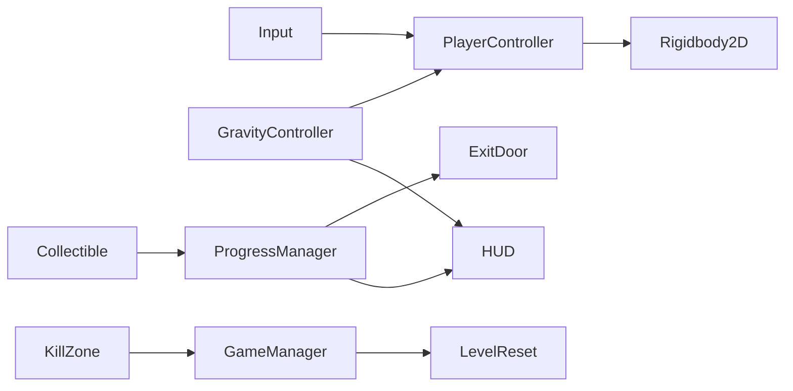

# Gravity Flip — Game Concept and Design

> Module: Game Programming · Document version: 1.1 (Level01 layout approved)  
> Repository: [Gravity_flip](https://github.com/jiojioYize/Gravity_flip)

This document supports the **Game Concept and Design (20%)** assessment and serves as the design reference for development. It will be expanded into the formal module submission (Word/PDF) as required.

---

## 1. Game idea

**Gravity Flip** is a 2D side-scrolling puzzle platformer built around one core mechanic: the player can instantly invert the direction of gravity acting on their character. The level geometry stays fixed — platforms, walls, and collectibles do not move or rotate. Only the character’s force direction and visual orientation change.

The intended feeling is spatial novelty (“I am walking upside-down on the ceiling, but the room still looks the same”) combined with short puzzles where flipping gravity is the only way to reach a goal.

---

## 2. Player experience

| Moment | Experience |
|--------|------------|
| First flip | Surprise — character falls toward the ceiling and walks inverted |
| Puzzle solve | Satisfaction — a collectable unreachable by normal jump becomes reachable via ceiling path |
| Failure | Fair reset — return to start, try again without harsh penalty |
| Win | Clear feedback — progress counter updates, door opens, level complete |

**Reference puzzle (Collectable 1):** A collectable sits near the ceiling. From the ground, jumping cannot reach it. The player flips to the ceiling, positions above the collectable, flips back, and collects it while falling diagonally left or right to avoid the hazard directly below. The full **Level01** layout (four collectables, shuttle platform, linear progression) is specified in [Section 11](#11-level01--detailed-level-design-approved).

---

## 3. Core mechanics (baseline requirements)

1. **Move** — Smooth horizontal movement (A/D or arrow keys); no ice-skating feel.
2. **Jump** — Only when standing on a walkable surface (ground or ceiling).
3. **Flip gravity** — Shift key; instant; unlimited uses; character lands on the opposite surface.
4. **While inverted** — Left/right still map to screen left/right; jump direction follows current “up”.
5. **Win condition** — At least one action/collect that **requires** a gravity flip; exit locked until complete.
6. **Failure** — At least one hazard (e.g. pit, spikes); death resets position, normal gravity, and progress.
7. **HUD** — Gravity direction indicator, progress counter (e.g. `0/1`), control hints.
8. **Feedback** — Simple SFX for jump, flip, collect, fail; visible flip on character sprite.
9. **Stability** — No tunneling through colliders; no soft-locks.

---

## 4. Main systems



| System | Responsibility |
|--------|----------------|
| `PlayerController2D` | Move, jump, ground check |
| `GravityController` | Flip gravity vector, sync HUD, flip player visual |
| `ProgressManager` | Track collectables; notify door and UI |
| `ExitDoor` | Locked until progress complete; trigger win |
| `KillZone` / hazards | Trigger level reset |
| `GameManager` | Spawn point, reset state, scene flow |
| `GameplayHUD` | Keys/progress, gravity icon, control text |
| `AudioManager` | Play one-shot SFX (and BGM if time allows) |

---

## 5. Scope — what is in / out

### In scope (vertical slice)

- **One polished level** (`Level01`) — linear left-to-right progression; see Section 11
- **Four collectables** (`Keys 0/4`), each teaching a distinct use of gravity flip and/or the shuttle platform
- **Shuttle platform** — spawns left, moves right only, despawns after fully exiting the final hazard corridor; respawns at left for a new **run** (see Section 11)
- All baseline requirements in Section 3 (HUD, SFX, flip feedback, hazards, `R` reset implemented)
- Placeholder or royalty-free 2D art; SFX documented in [AUDIO_SOURCING.md](AUDIO_SOURCING.md)

### Stretch goals (after baseline, pick by value)

| Priority | Feature | Status |
|----------|---------|--------|
| A | Main menu, Esc pause, win panel (scoped UX-1–3) | Done (verified 2026-06-04) |
| A | `R` to reset level | Done |
| B | Multiple collectables with distinct flip paths | Done — four keys, Level01 Section 11 (verified 2026-06-03) |
| C | BGM | Pending (optional) |
| C | SFX + flip screen flash | Done |
| D | Kenney art pass for platforms / hazards | Done — *1-Bit Platformer Pack* on Level01 gameplay objects (`docs/SPRITE_SOURCING.md`); backdrop/HUD/flow UI optional |

### Game flow (scoped stretch — approved 2026-06-03)

Player journey for the vertical slice (placeholder UI first; art swap later):

```text
MainMenu → [short story] + Start button → Level01
              ↳ Esc: Resume | Instructions | Main menu
              ↳ Death: quiet respawn (SFX + reset), no Game Over screen
              ↳ Win: simple panel → Play again | Main menu
```

- **Death:** Quiet respawn only (team preference). Distinct from **`R`** reset (reset SFX, no death SFX).
- **Not in this slice:** Auto-start without button, full-screen failure modal, quit-game as primary flow.

See [SETUP.md](../SETUP.md) section 19 and [TECHNICAL_DECISIONS.md](TECHNICAL_DECISIONS.md).

### Out of scope (unless time remains)

- Second full level, enemy AI, complex scripted cutscenes
- Multiplayer, save system, mobile build
- Full-screen Game Over on kill zone

**Rationale:** Assessment rewards a **complete, tested vertical slice** over feature count. A single strong level with clear flip-dependent puzzles matches the module example of “one memorable mechanic, one polished level”.

---

## 5. Tools and technical environment

| Item | Choice |
|------|--------|
| Engine | Unity 2022.3.62f3 LTS (Personal) |
| Physics | 2D — `Rigidbody2D`, `Physics2D` |
| Input | Legacy Input Manager (Shift / Space / AD) |
| Version control | GitHub — steady commits, README, this document, TESTLOG |
| IDE assistance | Cursor (local `.cursor/rules/` only; not pushed to remote) |

---

## 6. Assets and resources

| Type | Plan | License / credit |
|------|------|------------------|
| Sprites | Kenney *1-Bit Platformer Pack* for Level01 gameplay (`Assets/Tiles/`); backdrop/HUD optional | CC0 / [SPRITE_SOURCING.md](SPRITE_SOURCING.md) |
| SFX | Kenney impact & UI packs or similar | CC0 / credit in README |
| BGM | Optional loop from free library | Credit in README before submission |

**Legal / ethical:** Only use assets with clear licenses; list every external asset in README before final submission. No copyrighted material without permission.

**Accessibility:** Control hints always visible on HUD; keys listed in README and in-game.

---

## 7. Development plan

### Week 1 — Core playable

| Day | Milestone |
|-----|-----------|
| D1 | Concept doc + README v0 (this commit) |
| D1–2 | Player move, jump, ground check |
| D3 | Gravity flip + inverted visual |
| D4 | Level blockout: ground, ceiling, collectable, door, hazard |
| D5 | Win logic + HUD |
| D6–7 | Death reset, collision stability, reference puzzle playable |

### Week 2 — Polish and submit build

| Day | Milestone |
|-----|-----------|
| D8–9 | SFX, flip feedback, feel tuning |
| D10 | Menu / pause / R reset (stretch A) |
| D11–12 | Optional extra collectables or BGM |
| D13–14 | Full test pass, README v2, export build if required |

### Week 3 — Report and demo

- Written report: design choices, technical implementation, testing, reflection
- Live demo script: goal → flip puzzle → collect → door → failure reset
- Expand this document into formal Concept submission if required by VLE

---

## 8. Testing approach

Playtest after each milestone. Record entries in [Assets/Documentation/TESTLOG.md](../Assets/Documentation/TESTLOG.md):

- Date, what was tested, issue found, fix applied, retest result

Report will reference TESTLOG for “what changed because of testing”.

---

## 9. Connection to module assessment

| Assessment part | How this project addresses it |
|-----------------|-------------------------------|
| Concept and Design (20%) | This document + realistic scope |
| Final Game (40%) | Playable Level01 vertical slice |
| Report (within 40%) | Decisions, testing, reflection from TESTLOG |
| Demo (20%) | Flip puzzle walkthrough + system explanation |
| Professionalism (20%) | GitHub history, README, TESTLOG, steady progress |

---

## 11. Level01 — detailed level design (approved)

This section records the **approved** layout and rules for `Level01`. Implementation should follow this before further level blockout. Playtesting notes go in [TESTLOG.md](../Assets/Documentation/TESTLOG.md).

### 11.1 Level goals

| Goal | Rule |
|------|------|
| Progress | `Keys 0/4` — all four collectables required |
| Win | Exit door opens at `4/4`; player reaches door on foot |
| Core lesson | Gravity flip is required; shuttle platform extends timing, routing, and commitment |
| Failure | Kill zones (pits, spikes) → respawn, normal gravity, progress reset |
| Planning mistakes | `R` — full level reset when the player commits to a bad route (especially missing Collectable 4) |

### 11.2 World rules (unchanged)

- Only the **player** gravity direction and visual orientation change; level geometry does not rotate.
- Hazards are readable (spikes, pits) where possible; debug colours may be used until the art pass.

### 11.3 Spatial layout — left to right

The level is a **single linear route**. After the player moves past a section, **geometry and hazards must not allow backtracking** (no return path to earlier collectables or to re-enter the spike corridor from the right).

```text
[S spawn] ──► [C1 zone] ──► [C2 + shuttle] ──► [C3 jump] ──► [C4 spike corridor] ──► [door]
   ground        ceiling/         platform         ground         platform-only
                 flip puzzle      (after C1)       + pit          then ground
```

### 11.4 Collectables — visibility and roles

| ID | Position | Visible at start? | Role |
|----|----------|-----------------|------|
| **C1** | Near ceiling, centre-left area | Yes | Teach ceiling path + second flip + diagonal fall |
| **C2** | On the shuttle platform (moves with it) | Only when platform is active | Teach timing + boarding from ceiling + landing on a moving surface |
| **C3** | Fixed on ground, right of C2 segment | Yes | Teach jump from platform, horizontal clearance over pit/spike hazard |
| **C4** | Fixed in air, jump height inside spike corridor | Yes | Timed jump from under-platform (inverted gravity) during an active shuttle run through the corridor |

Collectable 2 is **not** visible at level start; it appears and disappears with the platform.

### 11.5 Collectable 1 (implemented baseline)

1. Player starts on the **left** (ground).
2. C1 is **not** reachable by ground jump alone.
3. Player flips to **ceiling**, moves above C1, then flips back.
4. While falling, player collects C1 and moves **left or right** to land on safe ground — **not** straight down through the hazard under C1 (spikes/pit on the floor).
5. Collecting C1 enables the shuttle platform system (see 11.6).

### 11.6 Shuttle platform — movement model (Scheme B)

**Definition of one run (一趟 / “next round”):**

1. Platform **spawns at the left** origin.
2. Platform moves **only left → right** along the full track (including through the C4 spike corridor).
3. Platform may **only despawn after it has fully exited** the C4 spike corridor on the right.
4. If the player is still on the platform when it despawns: parenting ends and the player **falls** under normal physics (expected failure if they did not dismount in time).
5. Platform **reappears at the left** origin — a new run begins. This is what “wait for the next round” means for **C2**.

**Boarding:**

- The platform supports boarding from **top and bottom** (ground gravity: stand on top; inverted gravity: use ceiling / underside boarding as designed in implementation).
- For **C2**, the intended route is: flip to ceiling, align with the platform, then drop onto it to collect while it moves.

**Activation:**

- Platform system **starts after Collectable 1** is collected.

### 11.7 Collectable 2

- Parented to or spawned with the platform; **exists only while that platform instance exists**.
- If missed on a run, the player may try again on the **next run** when the platform respawns at the left — provided the player is still in the **left / pre-corridor** region and can board in time.
- Missing C2 is a **timing** mistake, not a permanent spatial lockout.

### 11.8 Collectable 3

- Fixed position; visible from start.
- Placed above a **ground hazard** (pit with spikes or similar).
- Player should jump from the shuttle platform, then **jump right** (or move right in air) to collect C3 and clear the hazard in one planned movement.
- Because the level does **not** allow backtracking, missing C3 after progressing right requires **`R`** (or death reset), not “wait for the next platform run” from the wrong side of the map.

**Level building note:** C3 must sit on the **only forward route** before the player is forced into the C4 corridor setup, so players cannot reach the corridor without passing the C3 approach.

### 11.9 Collectable 4 and spike corridor (critical rules)

**Environment:**

- A **wide hazard corridor** where **both floor and ceiling** are dangerous (large spike fields or equivalent).
- The player **cannot** walk through on foot; they must **ride the shuttle platform** through the corridor.

**Collection:**

- Use the shuttle run to reach the corridor. **Flip gravity** so the player is on the **underside** of the platform, then enter the spike corridor with the moving platform.
- C4 sits in the corridor at a position inside **jump range** (not auto-collected by riding through the trigger).
- The player must **time a jump** into C4 while the shuttle **run is still active** (platform moving through the corridor). Missing the jump or touching spikes uses normal death / reset rules.

**Why missing C4 is permanent without `R` (spatial logic):**

The platform **does** loop (new runs from the left), but the **player’s position** advances one-way:

1. If the player **leaves the corridor on the platform without C4**, they are now **to the right** of the corridor.
2. Further boarding is only possible **after the platform has exited the corridor** on the right (boarding zone design).
3. The platform **never moves right → left**, so it never re-enters the corridor from the right.
4. On a later run, the platform enters the corridor from the **left** while the player is stranded on the **right** — the player cannot be on board during corridor transit again.
5. Therefore **missing C4 is not recoverable by waiting for the next platform run**; the player must use **`R`** to restart the level.

This is intentional: a **planning / commitment** mistake, not an arbitrary collection order puzzle.

### 11.10 After Collectable 4 — exit

1. Once `4/4`, the player should **dismount** after the platform clears the corridor (or on the safe ground beyond it).
2. **Flip to normal down gravity** on safe ground if needed.
3. Walk **right** to the exit door (no backtracking).
4. Door triggers level complete when progress is complete.

### 11.11 Hazards summary

| Hazard | Location | Purpose |
|--------|----------|---------|
| Under C1 | Floor under ceiling collectable | Punish straight drop; teach diagonal landing |
| C3 area | Pit / spikes on ground | Jump timing from platform |
| C4 corridor | Floor + ceiling spikes | Force platform use; no on-foot crossing |
| Kill zones | Pits below play space | General failure; works with fall from despawn |

### 11.12 Reset and feedback

| Input / event | Effect |
|---------------|--------|
| Kill zone | Death SFX, respawn at start, gravity down, `0/4` progress |
| `R` | Level reset SFX (optional clip), same as respawn without death SFX |
| Collect / door / flip | Wired in `AudioManager`; see AUDIO_SOURCING.md |

### 11.13 Implementation phases (code + Editor)

| Phase | Deliverable |
|-------|-------------|
| **P1** | `MovingPlatform2D`, spawn after C1, left→right path, despawn only after corridor exit trigger, player carry + fall on despawn |
| **P2** | C2 on platform, top/bottom boarding, loop runs for practice |
| **P3** | C3 placement, jump-down from platform, hazard clearance |
| **P4** | C4 corridor colliders, timed jump collect during active shuttle run, safe dismount + walk to door; full playtest |

Editor setup steps will be added to [SETUP.md](../SETUP.md) as each phase is implemented.

### 11.14 Demo script (for presentation)

1. Show HUD `0/4` and fixed collectables visible in the level.
2. Complete C1 — flip, diagonal collect, avoid hazard below.
3. Explain shuttle platform appears; collect C2 on a run (optional: miss once, show next run).
4. Dismount, collect C3 over pit hazard.
5. Board for corridor; flip under the platform, enter the spike zone, and **jump** to collect C4 on timing.
6. Dismount, flip down, enter door at `4/4`.
7. Optional: show kill reset and `R` after a deliberate mistake at C4.

---

## 10. Document history

| Version | Date | Notes |
|---------|------|-------|
| 1.0 | Planning phase | Initial concept from requirements doc; pre-implementation |
| 1.1 | 2026-05-26 | Added approved Level01 layout (four collectables, shuttle platform, C4 spatial irreversibility) |
